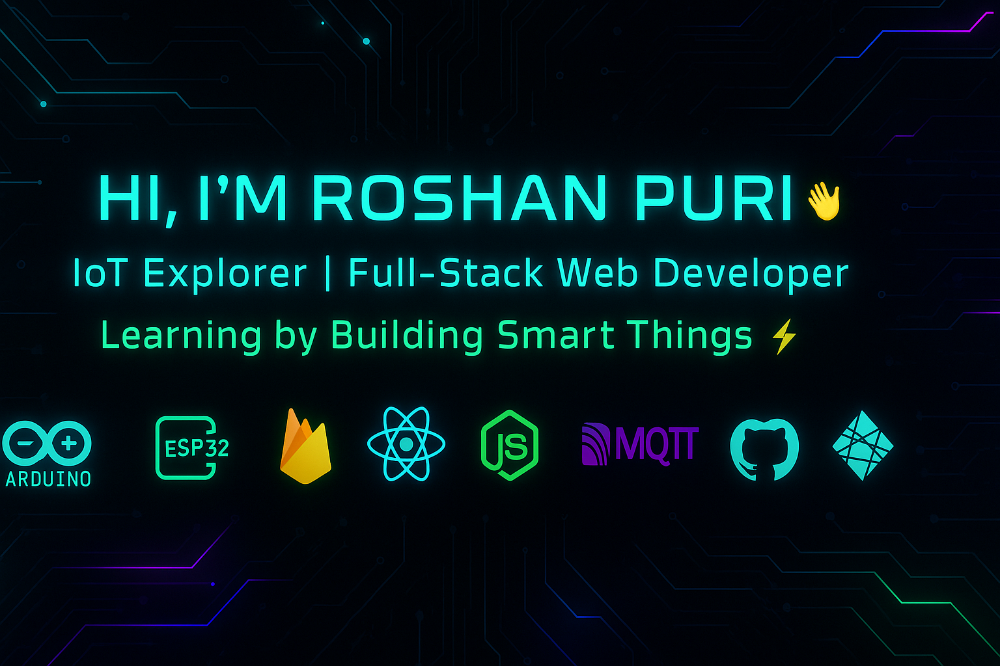

<p align="center">
  
</p>
<h2 align="center">👋 Hello, I’m <span style="color:#00FF94">Roshan Puri</span></h2>
<h4 align="center">IoT Explorer ⚙️ | Full-Stack Developer 💻 | BEIT @ Pokhara University 📚</h4>

---

🚀 **What I Do**

- 🌱 Building Smart IoT Projects (ESP32, Firebase, Sensors)
- 💡 Exploring Full-Stack SaaS with React + Node.js + MongoDB
- 📡 Learning MQTT, Node-RED, Blynk for device communication

---

🧰 **Tech Stack**

```yaml
Languages      : C, C++, Python, JavaScript
Web Dev        : HTML, CSS, React ⚛️, Node.js 🚀, Express
IoT Hardware   : Arduino, ESP32, Sensors
IoT Protocols  : MQTT, Firebase 🔥, HTTP
Cloud & Tools  : GitHub 🐙, VS Code 💻, Netlify ☁️, ThingSpeak 📊

